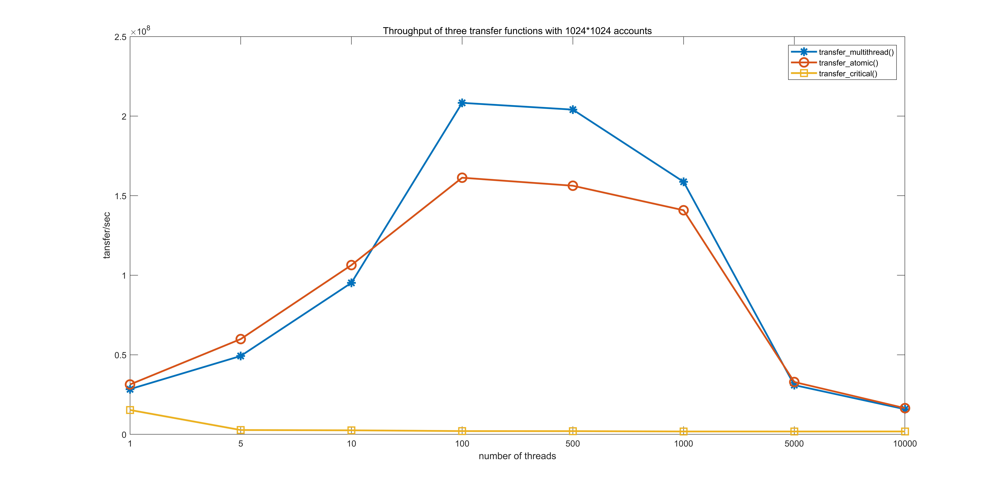
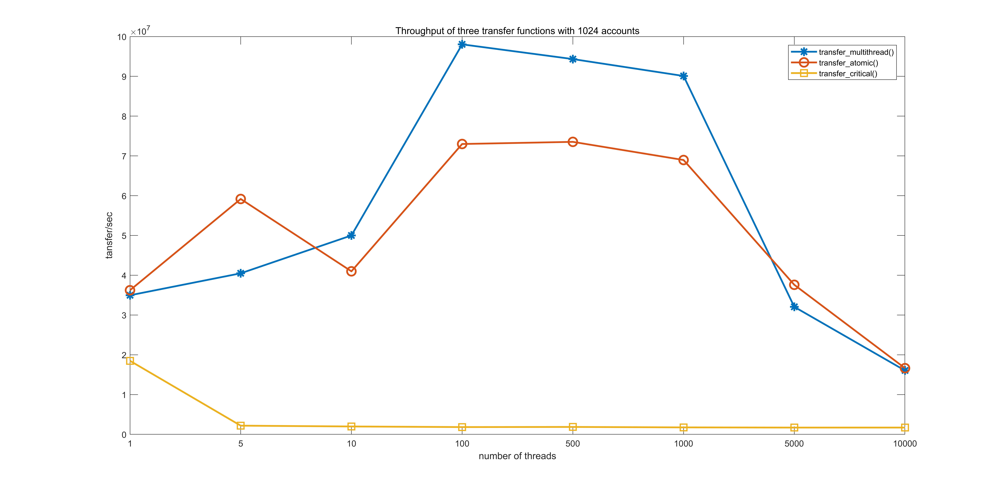
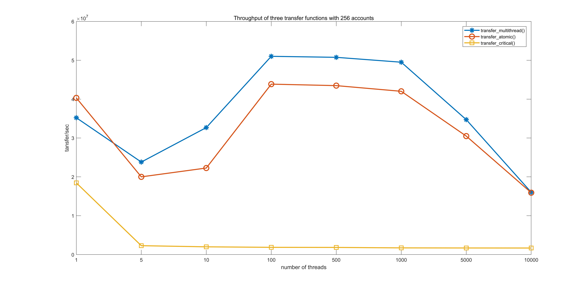
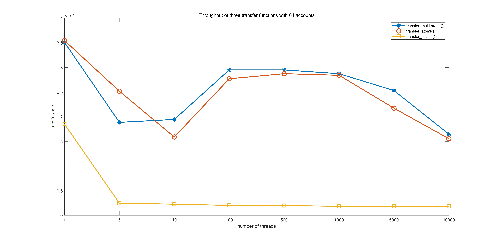
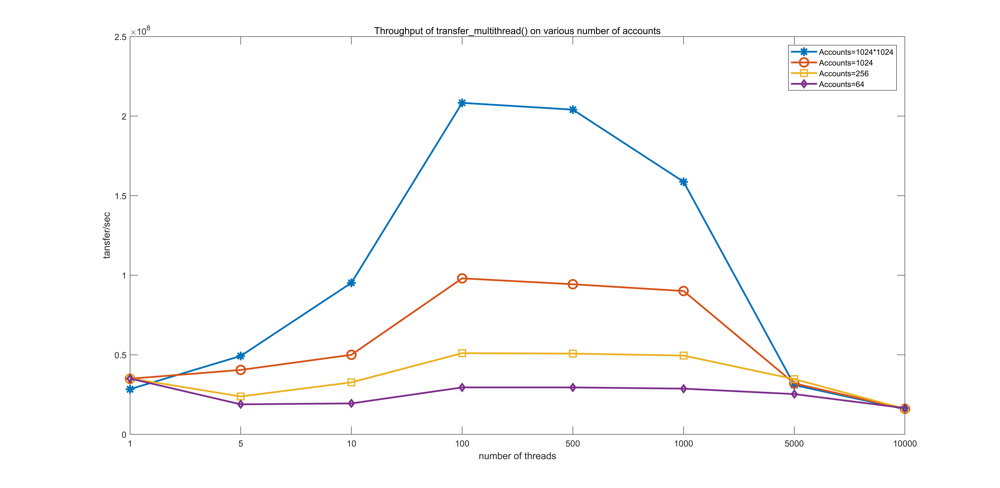
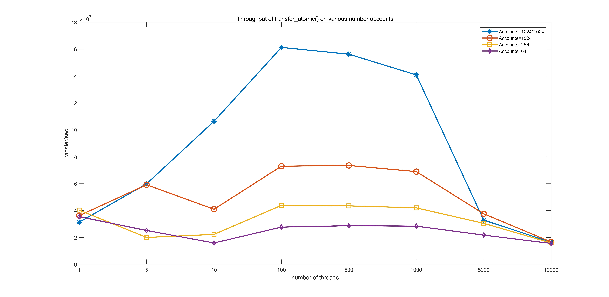
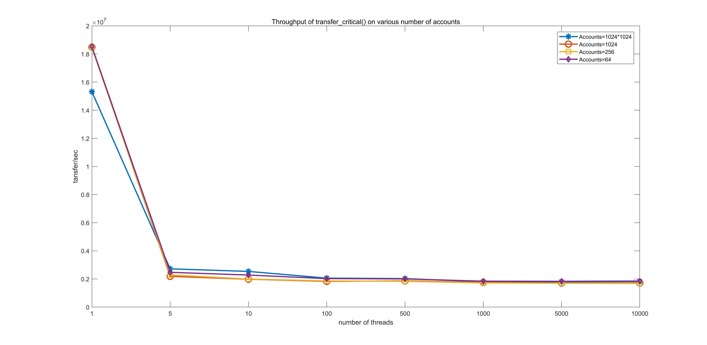

# Three attempts to implement banking transfer
- [Naive multithreaded program](https://github.com/WangSiman-Carol/ParallelismMaster-ZerotoOne/blob/master/Old-school-problem/multithread.cpp) without any synchronization control.
- [Atomic operations](https://github.com/WangSiman-Carol/ParallelismMaster-ZerotoOne/blob/master/Old-school-problem/atomic.cpp).
- [Critical section](https://github.com/WangSiman-Carol/ParallelismMaster-ZerotoOne/blob/master/Old-school-problem/critical_section.cpp).

### Environment: 
Linux, C++11, pthread.
Here is the [compile and execution guide](.\compile info.txt)
### Notice:all experiments are conducted with 10,000,000 transcations.

## What's wrong with the naive multithreaded program?
Function transfer_multi() runs correctly when there is only one thread except the main thread. Apart from this case, it fails no matter how many threads are. It is because we do nothing to control synchronization. Problems happen in this naive multithreaded program: data races, incoherence, inconsistence, etc. We explain problems for specific lines in comments. As a result, the total amount of balance of all accounts changes.


```
void transfer_multi(int tid){
    unsigned int s0 = 0 + tid, s1 = 2 + tid, s2 = 3 + tid;
    int d;
    int s;
    int amount;

    for(long i = 0; i < ITER/NUM_THREADS; ++i){
        s = rand_r(&s0) % SIZE;
        d = rand_r(&s1) % SIZE;
        amount = rand_r(&s2) % 1000;

        // Incoherency. Multiple threads might not 
        // read newest values and enter the if block.
        if (accounts[s] >= amount){ 
            // Inconsistence & data races. There are three operations in 
            // this line: load, substract and store. Unknown ordering of threads 
            // execution leads to unexpected results.  
            accounts[s] -= amount;
            // Inconsistence & data races. There are three operations in 
            // this line: load, add and store. Unknown ordering of threads 
            // execution leads to unexpected results.
            accounts[d] += amount;    
        }        
    }
}
```


## Which implementation is more efficient? Atomic or critical section?
This picture shows throughput of three functions with different threads number, and size of accounts is 1024*1024. Particularly, as mentioned before, function transfer_multithread() runs correctly when there is only one thread except the main thread. Though transfer_multithread() fails with more than one sub-threads, it is reasonable to plot its performance as the benchmark.




## How account size affects throughput and thread scalability?
The following three pictures show throughput of three functions with different threads number, and size of accounts is 1024, 256, 64 respectively.





In order to clearly display how size of accounts array affects throughput and thread scalability, we draw three illustrations where each illustration show the throughput of a specific function on various size of accounts.





First, the throughput of function transfer_atomic() increases as size of accounts (accounts number) increases, which shows identical trend with benchmark function transfer_multithread(), while the throughput of function transfer_critical() almost remains the same no matter how large the size of accounts is.

Second, more threads does not mean better performance. The throughput of transer_atomic() reaches its peak when number of threads is 100, stays plain and then decreases as threads enlarge. The thoughput of transfer_critical() on single thread is hugely greater than multiple threads, but its changes among different number of threads are negligible.
